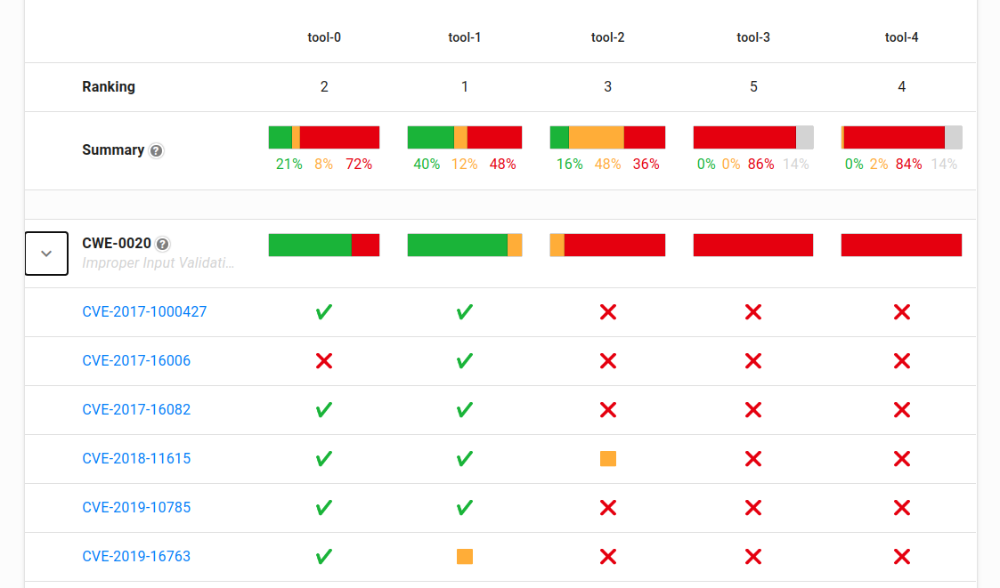

# ossf-cve-benchmark

***Note, this project is still in development.  The README files and may
not be up entirely to date, and some features may be missing.***

TODO @esbena & others: General, and very polished intro



## Installing the CVE benchmarker

To install the CVE benchmarker, simply clone this repo and run the installation
scripts provided:

```
$ git clone git@github.com:ossf-cve-benchmark/ossf-cve-benchmark.git
$ cd ossf-cve-benchmark
$ npm i
$ npm run-script build
```

On Linux and macOS, you can invoke the benchmarker by runnning `bin/cli`
with the appropriate command-line options. 
On Windows, you need to run `bin/cli.cmd`.

To confirm that you have successfully installed the benchmarker,
run `bin/cli -h` to display usage and basic help
information:

```
$ bin/cli -h
usage: bin/cli [-h] { ... }

CLI for ossf-cve-benchmark

...
```

## Using the CVE benchmarker

The CVE benchmarker has two primary uses: running code analysis tools over CVE data
and creating benchmark reports.

### Use case 1: Running code analysis tools

You can evaluate the ability of code analysis tools to generate alerts by running them
over the source code of the commits associated with selected CVEs. Using the data generated 
in these analysis runs, you can then generate benchmark reports to show how the tool performed. 
For more information about generating benchmark reports, see 
[Use case 2: Benchmark reports](#use-case-2-exploring-benchmark-reports) below.

Before running an analysis, you must install the tool and configure a tool driver.
A tool driver is a script that acts as the interface
between the analysis tools and the CVE benchmarker.
For reference information about analysis tool drivers, including information 
about adding drivers for new tools, see 
[Analysis tools](docs/analysis-tools.md)(contrib/tools/eslint/README.md). 
To see how to setup `eslint` to run an analysis, see 
[Generating a benchmark report for `eslint`](docs/eslint-example.md)

To run an analysis, use the `bin/cli run` command 
specifying:

- the identifier of the driver for your analysis tool, 
  as given in [`config.json`](docs/configuration.md), using the `--tool` option. 
- one or more CVEs to run the analysis on. For more information, 
  see [Selecting CVEs of interest](docs/configuration.md#selecting-cves-of-interest).

For example, to run an analysis using `eslint` over CVE-2018-16492 
and CVE-2020-4066 you would use:

```
$ bin/cli run --tool eslint-default CVE-2018-16492 CVE-2020-4066
```

where `eslint-default` is the name of the driver configured for `eslint`
analysis.

### Use case 2: Benchmark reports

You can use data generated locally by `bin/cli run` or existing 
data provided in JSON format to create benchmark reports to see 
how a tool performed.

To create a benchmark report using data generated locally `bin/cli run`,
use the `report` command specifying:

- the name of the driver for your analysis tool using the `--tool` option.
- how you would like to view the report using the `--kind`
  option. To start a server to view the report, specify `server`.
  To view a static report, specify `txt`.
- one or more CVEs to include data for.

For example, to start a report server using data from running an 
analysis with `eslint` for CVE-2018-16492 and CVE-2020-4066,
you would use:

```
$ bin/cli report --kind server --tool eslint-default CVE-2018-16492 CVE-2020-4066
```

After running this command, you can view the report at https://localhost:8080.

Alternatively, use `--kind txt` to create a static, debugging-oriented report:

```
$ bin/cli report --kind txt --tool eslint-default CVE-2018-16492 CVE-2020-4066
```

To start a report server using data provided in `export.json`, use:

```
$ bin/cli report --kind server --import export.json --tool eslint-default CVE-2018-16492 CVE-2020-4066
```
## Status and roadmap

This project is in its infancy, it currently supports benchmarking
four JavaScript security analysis tools on 200 CVEs. The benchmark
results can be viewed in two simple reports.

In time, the following high-level improvements are expected:

- additional CVE data, for both JavaScript and other languages
- support for additional security analysis tools, for both JavaScript and other languages
- more advanced reports

At the meta-level, this project expects to soon formalize versioning
and release strategies, and to make the workflows for external
contributions as seamless as possible.

### Non-goals

This project does not attempt to define a monolithic one-size-fits-all
security benchmark, such as https://samate.nist.gov/SARD. Rather, this
project contains the data and tooling for benchmarking selected
security analysis tools on security issues of interest.

This project is closely related to, but does not attempt to replace or compete with:

- existing views of CVE information, such as https://cve.mitre.org
  - rather, this project hopes that the information in this project makes its way to such views
- existing software analysis result formats, such as https://sarifweb.azurewebsites.net
  - rather, this project aims to have a simple analysis result format in order to have a low bar of entry for new analysis tools
- existing platforms for disclosing security vulnerabilities, such as https://www.hackerone.com
  - rather, this project contains simple descriptions of the weaknesses of the above vulnerabilities

## Contributing

We welcome contributions to ossf-cve-benchmark project.  If you want
to contribute, then please go ahead and open a pull request! See
additional details in our [contributing guidelines](CONTRIBUTING.md).

## License

The code in this repository is licensed under the [MIT License](LICENSE).
